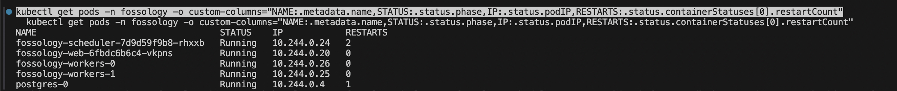
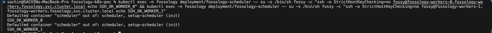
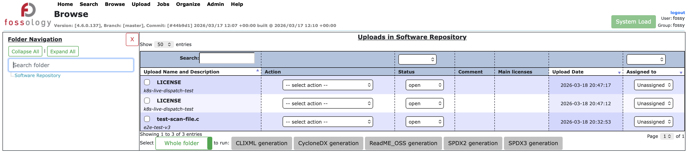
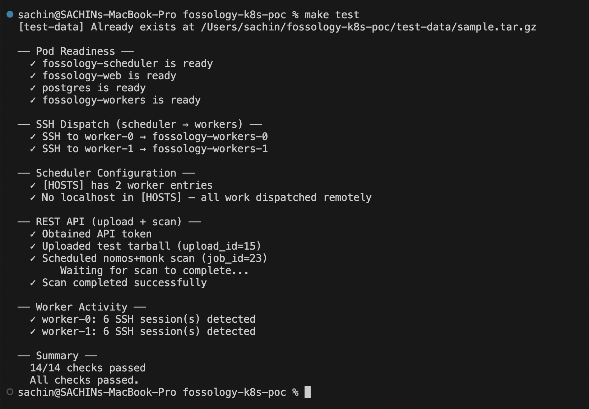

# FOSSology on Kubernetes — Proof of Concept

FOSSology running on a local [kind](https://kind.sigs.k8s.io/) cluster with scheduler, web UI, database, and **separate worker pods** — all communicating over SSH through the Kubernetes pod network. Zero patches to FOSSology source code.

## What This Proves

1. **Worker separation works** — agent pods run in their own StatefulSet, fully decoupled from the scheduler
2. **SSH dispatch over K8s networking** — the scheduler's native `[HOSTS]` mechanism reaches workers via stable DNS, no sidecar or gRPC bridge needed
3. **End-to-end scans complete** — uploads through the web UI produce license findings (nomos, monk, etc.) executed entirely on remote worker pods
4. **Production-readiness foundations** — resource limits, liveness/readiness probes, NetworkPolicy, HPA, Kustomize overlays, and CI

---

## Quick Start

### Prerequisites

- [kind](https://kind.sigs.k8s.io/) and `kubectl`
- Docker Desktop (or equivalent)
- GNU Make

### One-command setup

```bash
make up
```

This creates a kind cluster, builds images, generates SSH keys, deploys everything, and waits for all pods to be ready.

### Access the UI

```bash
make port-forward
```

Open http://localhost:8080/repo — log in with `fossy` / `fossy`.

### Run the smoke test

```bash
make test
```

Verifies pod readiness, SSH connectivity, scheduler config, REST API upload+scan, and worker activity.

### Tear down

```bash
make down
```

### Manual bootstrap (without Make)

<details>
<summary>Expand for step-by-step</summary>

```bash
# 1. Create the kind cluster
kind create cluster --config kind-config.yaml --name fossology-poc

# 2. Bootstrap everything
./scripts/bootstrap.sh

# 3. Access the UI
kubectl port-forward svc/fossology-web 8080:80 -n fossology

# 4. Verify SSH dispatch
kubectl exec deployment/fossology-scheduler -n fossology -- \
  su -s /bin/sh fossy -c \
  "ssh fossy@fossology-workers-0.fossology-workers.fossology.svc.cluster.local echo OK"
```

</details>

### Makefile targets

Run `make help` for the full list:

| Target                | Description                                  |
| --------------------- | -------------------------------------------- |
| `make up`             | Create cluster, build, deploy, wait          |
| `make down`           | Tear down the kind cluster                   |
| `make test`           | Run end-to-end smoke test                    |
| `make test-ssh`       | Verify SSH from scheduler → workers          |
| `make test-dns`       | Check worker DNS resolution                  |
| `make status`         | Show pod status                              |
| `make port-forward`   | Forward web UI to localhost:8080             |
| `make logs-scheduler` | Tail scheduler logs                          |
| `make logs-worker`    | Tail worker-0 logs                           |
| `make logs-web`       | Tail web logs                                |
| `make check-conf`     | Show [HOSTS] from scheduler's fossology.conf |
| `make clean`          | Tear down + remove generated files           |

---

## Proof of Concept — Evidence

### 1. All pods running with separate IPs

The scheduler, web, and worker pods each run in their own pod with distinct IPs — workers are fully separate from the scheduler:

```
$ kubectl get pods -n fossology -o custom-columns="NAME:.metadata.name,STATUS:.status.phase,IP:.status.podIP,RESTARTS:.status.containerStatuses[0].restartCount"

NAME                                   STATUS    IP            RESTARTS
fossology-scheduler-7d9d59f9b8-rhxxb   Running   10.244.0.24   2
fossology-web-6fbdc6b6c4-vkpns         Running   10.244.0.20   0
fossology-workers-0                    Running   10.244.0.26   0
fossology-workers-1                    Running   10.244.0.25   0
postgres-0                             Running   10.244.0.4    1
```

<p align="center">
  
</p>

### 2. SSH dispatch — scheduler to worker pods

The scheduler dispatches agents to workers over SSH using the Kubernetes pod network. The `fossy` user on the scheduler can SSH into both workers:

```
$ kubectl exec deployment/fossology-scheduler -n fossology -- \
    su -s /bin/sh fossy -c "ssh fossy@fossology-workers-0...svc.cluster.local echo SSH_OK"
SSH_OK_WORKER_0

$ kubectl exec deployment/fossology-scheduler -n fossology -- \
    su -s /bin/sh fossy -c "ssh fossy@fossology-workers-1...svc.cluster.local echo SSH_OK"
SSH_OK_WORKER_1
```

The `[HOSTS]` section in `fossology.conf` contains **only remote workers** (no localhost), so all agent work is dispatched over SSH:

```ini
[HOSTS]
fossology-workers-0 = fossology-workers-0.fossology-workers.fossology.svc.cluster.local /usr/local/etc/fossology 4
fossology-workers-1 = fossology-workers-1.fossology-workers.fossology.svc.cluster.local /usr/local/etc/fossology 4
```

<p align="center">
  
</p>

### 3. Web UI — scans completing

The FOSSology web UI is accessible at `http://localhost:8080/repo` via port-forward. Uploads are scanned by agents dispatched to worker pods, and license findings (GPL-2.0-only, LGPL-2.1-only, etc.) appear in the license browser:

<p align="center">
  
</p>

### 4. Automated smoke test — 14/14 checks pass

Running `make test` executes a full end-to-end verification suite that validates every layer of the PoC — pod readiness, SSH dispatch, scheduler configuration, REST API upload → scan → completion, and worker activity:

<p align="center">
  
</p>

---

## Architecture

<p align="center">
  
</p>

| Component                   | K8s Resource                    | Role                                                        |
| --------------------------- | ------------------------------- | ----------------------------------------------------------- |
| **fossology-web**           | Deployment + ClusterIP Service  | Apache/PHP UI on port 80                                    |
| **fossology-scheduler**     | Deployment                      | `fo_scheduler` — reads `[HOSTS]`, dispatches agents via SSH |
| **fossology-workers-{0,1}** | StatefulSet + Headless Service  | `sshd` + all FOSSology agents; receive work from scheduler  |
| **postgres**                | StatefulSet + ClusterIP Service | PostgreSQL database                                         |
| **fossology-repo**          | PersistentVolumeClaim (RWX)     | Shared repository storage across web, scheduler, workers    |

The scheduler uses FOSSology's built-in SSH dispatch mechanism. For each host listed in `[HOSTS]`, it forks and calls:

```c
// agent.c — simplified
args[0] = "/usr/bin/ssh";
args[1] = host->address;   // fossology-workers-0.fossology-workers.fossology.svc.cluster.local
args[2] = agent_binary_cmd;
execv(args[0], args);
```

Workers are a `StatefulSet` so they get stable DNS names (required for the `[HOSTS]` config). A headless Service resolves worker FQDNs directly to pod IPs.

---

## Repository Structure

```
fossology-k8s-poc/
├── .github/
│   └── workflows/
│       └── ci.yaml                      # GitHub Actions — e2e smoke test
├── docs/
│   ├── fossology_k8s_architecture.svg   # Architecture diagram
│   └── screenshots/                     # PoC evidence screenshots
├── images/
│   └── worker/
│       └── Dockerfile                   # fossology base + sshd
├── kustomize/
│   ├── base/
│   │   └── kustomization.yaml           # Base — references manifests/
│   └── overlays/
│       ├── dev/
│       │   └── kustomization.yaml       # Dev — fewer replicas, smaller limits
│       └── production/
│           └── kustomization.yaml       # Prod — private registry, HPA, scaled
├── manifests/
│   ├── namespace.yaml
│   ├── configmap.yaml                   # Db.conf, fossology.conf ([HOSTS])
│   ├── shared-pvc.yaml                  # RWX PVC for repository
│   ├── postgres.yaml                    # StatefulSet + Service
│   ├── web.yaml                         # Deployment + Service (port 80)
│   ├── scheduler.yaml                   # Deployment + init container (SSH setup)
│   ├── worker-statefulset.yaml          # StatefulSet + headless Service (port 22)
│   ├── hpa-workers.yaml                 # HorizontalPodAutoscaler (CPU-based)
│   └── networkpolicy.yaml               # Per-component ingress rules
├── scripts/
│   ├── bootstrap.sh                     # One-command cluster setup
│   ├── generate-keys.sh                 # SSH keypair + K8s Secret
│   ├── generate-test-data.sh            # Create tarball with known licenses
│   ├── smoke-test.sh                    # End-to-end verification
│   ├── teardown.sh                      # Delete the kind cluster
│   └── wait-for-ready.sh               # Poll until all pods are Ready
├── kind-config.yaml                     # kind cluster config (NodePort mapping)
└── Makefile                             # Developer-friendly targets
```

## Kustomize

The `kustomize/` directory provides environment-specific overlays:

```bash
# Dev (single worker, smaller limits — good for laptops)
kubectl apply -k kustomize/overlays/dev/

# Production (4 workers, private registry, HPA enabled)
kubectl apply -k kustomize/overlays/production/
```

The base layer references the raw manifests, and overlays use JSON patches + image transformers to customize for each environment.

## Key Design Decisions

| Decision                                         | Reason                                                                              |
| ------------------------------------------------ | ----------------------------------------------------------------------------------- |
| `StatefulSet` for workers                        | Stable DNS names required for `[HOSTS]` entries                                     |
| Headless `Service` for workers                   | DNS resolves directly to pod IPs, no VIP                                            |
| `emptyDir` + init container for `fossology.conf` | Entrypoint uses `sed -i` (atomic rename), which fails on read-only ConfigMap mounts |
| Worker `ENTRYPOINT []`                           | Base `docker-entrypoint.sh` rewrites `Db.conf` on start — fails on ConfigMap mount  |
| `StrictModes no` in `sshd_config`                | K8s Secret-mounted `authorized_keys` is root-owned                                  |
| No localhost in `[HOSTS]`                        | Forces all agent dispatch to remote worker pods                                     |

## Security

- SSH keypair is **gitignored** — regenerate with `ssh-keygen -t ed25519 -f worker-key -N ""`
- `PasswordAuthentication no` enforced — only pubkey auth accepted on workers
- **NetworkPolicy** restricts ingress: workers accept SSH only from scheduler, postgres only from FOSSology pods
- **Resource limits** on all containers prevent noisy-neighbour issues
- For production: store keys in Vault / SealedSecrets instead of `bootstrap.sh` local keygen

---

## Future Roadmap — GSoC 2026

This PoC establishes the foundation for the full **"Kubernetes-Native Deployment with Scalable Agent Architecture"** project:

| Phase                         | Deliverable                                                                               | Status      |
| ----------------------------- | ----------------------------------------------------------------------------------------- | ----------- |
| **Phase 1 — PoC**             | SSH dispatch on Kubernetes, separate worker pods, end-to-end scans                        | ✅ Complete |
| **Phase 2 — Helm + GitOps**   | Helm chart, ArgoCD Application definitions, ConfigMap/Secret templating                   | Planned     |
| **Phase 3 — Autoscaling**     | KEDA ScaledObject (scale workers on job-queue depth), per-agent-type pod affinity         | Planned     |
| **Phase 4 — Scheduler Patch** | C-level patch to `fo_scheduler` for per-agent-type `[HOSTS]` groups, host affinity labels | Planned     |
| **Phase 5 — Long-term**       | Replace SSH dispatch with native Kubernetes Jobs/CronJobs (eliminates SSH entirely)       | Future      |

### Alignment with GSoC acceptance criteria

> _"A working FOSSology deployment on a local Kubernetes cluster… At least one agent worker pod running separately from the scheduler, with the scheduler successfully dispatching an agent to it via SSH over the Kubernetes pod network."_

This PoC satisfies all criteria with evidence: pod screenshots, SSH dispatch logs, browser scan results, and an automated smoke test that verifies the full pipeline.

## License

GPL-2.0-only — consistent with [FOSSology](https://github.com/fossology/fossology/blob/master/LICENSE).
